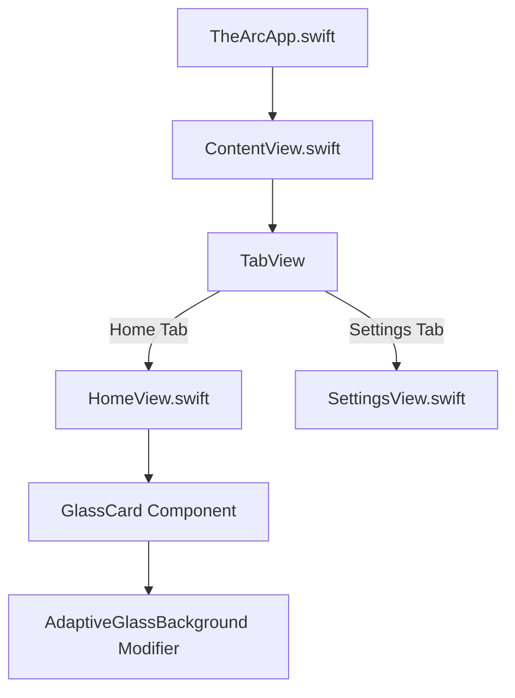
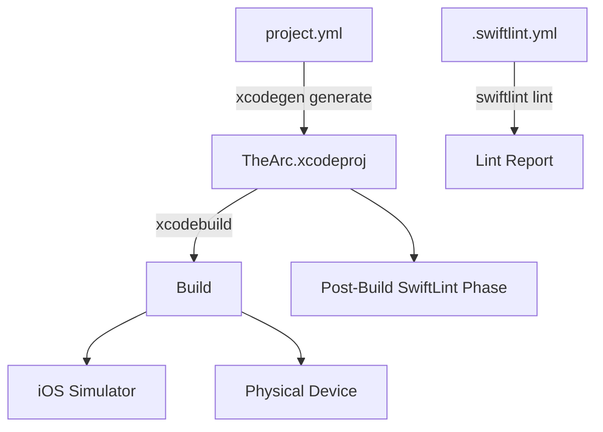

# The Arc — Living Project Whiteboard

Last verified: Derived from latest timestamp in `Async Run Event Log` (sharded append-only section).
Status: Active source of truth for engineering and operations

## Purpose

This is the single, continuously updated engineering whiteboard for the full project.

Use this file to:

- Understand architecture and view flow quickly
- Track operational runbooks and build behavior
- Coordinate scheduled role work through one canonical task board
- Capture decisions, risks, and next actions

## How To Update This Doc

Update this file in the same commit whenever you change:

- Architecture, view flow, or data flow
- Build behavior or XcodeGen config
- Tooling, scripts, or quality checks
- Known risks/workarounds

Required updates per run:

1. Append one async event row to the appropriate shard slot.
2. Include task status, validation, next step, and one change note in that row.
3. Do not edit existing async event rows.

## Agent Coordination Contract

Global policy:

- `AGENTS.md` defines mandatory run behavior for any agent.
- Every scheduled run must read this file first, claim a task, execute, validate, and record.

Hard rules:

- This file is the only persistent run memory.
- Do not create external journals.
- Keep tasks scoped and reversible.

## High-Level System Flow



## Repo Map

```text
/
  .gitignore
  .gitattributes
  .swiftlint.yml
  AGENTS.md
  PROJECT_WHITEBOARD.md
  project.yml                    # XcodeGen spec
  Sources/
    App/
      TheArcApp.swift            # @main entry point
      ContentView.swift          # Root TabView
    Views/
      HomeView.swift             # Home tab
      SettingsView.swift         # Settings tab
    Components/
      GlassCard.swift            # Reusable glass card
      AdaptiveGlassBackground.swift  # Glass ViewModifier
  Resources/
    Assets.xcassets/
      Contents.json
      AccentColor.colorset/
      AppIcon.appiconset/
```

## Build Flow



### Commands

```bash
# Generate Xcode project
xcodegen generate

# Build for simulator
xcodebuild -project TheArc.xcodeproj -scheme TheArc \
  -destination 'platform=iOS Simulator,name=iPhone 16' build

# Lint
swiftlint lint --strict

# Fix auto-fixable lint issues
swiftlint lint --fix
```

## Technology Stack

| Layer | Technology | Notes |
|---|---|---|
| Language | Swift 6.0 | Strict concurrency enabled |
| UI Framework | SwiftUI | iOS 26 Liquid Glass patterns |
| Deployment Target | iOS 18.0 | Minimum supported version |
| Build Generator | XcodeGen 2.44 | `project.yml` → `.xcodeproj` |
| Linting | SwiftLint 0.63 | Strict mode, performance rules |
| Design Language | Liquid Glass | With solid fallbacks for accessibility |

## iOS 26 Design Principles (Quick Reference)

### Material Layer Hierarchy

| Layer | Opacity | Purpose |
|---|---|---|
| Solid (Layer 4) | 100% | Critical text, icons, primary CTAs |
| Dynamic (Layer 3) | ~70% | Supporting text, secondary buttons |
| Glass (Layer 2) | ~40% | Decorative UI, dividers, subtle icons |
| Atmospheric (Layer 1) | ~20% | Background tints, overlays, depth |

### Key Rules

1. Let system handle tab bar / nav bar / toolbar glass — never override backgrounds
2. Use `.continuous` corner style everywhere
3. Max 2 glass layers stacked
4. Always check `reduceTransparency` + `isLowPowerModeEnabled` for fallbacks
5. Use `.foregroundStyle()` instead of `.foregroundColor()`
6. Use spring animations for interactions
7. Provide accessibility labels for icon-only buttons

## Known Gotchas

1. `*.xcodeproj` is git-ignored — regenerate with `xcodegen generate` after clone.
2. SwiftLint runs as a post-build script phase; install via `brew install swiftlint`.
3. `DEVELOPMENT_TEAM` in `project.yml` is empty — set your team ID for device builds.
4. iOS 26 glass effects are GPU-intensive — test on oldest supported device (iPhone 12).
5. Glass effects disable with Reduce Transparency — always provide solid fallbacks.

## Change Safe-Zones

**Low risk:**
- Content/copy changes in Views
- Asset catalog updates
- Non-functional docs updates

**Medium risk:**
- Navigation/routing changes in ContentView
- New view additions
- SwiftLint rule changes

**High risk:**
- project.yml structural changes (targets, settings)
- Swift concurrency model changes
- Large architectural refactors without test coverage

## Decision Log

| Date | Decision | Reason | Owner | Revisit |
|---|---|---|---|---|
| 2026-02-22 | Use XcodeGen instead of manual .xcodeproj | Reproducible builds, merge-friendly, single source of truth | Engineering | Quarterly |
| 2026-02-22 | Target iOS 18.0 minimum with iOS 26 glass fallbacks | Wide device support while adopting new design language | Engineering | At iOS 27 beta |
| 2026-02-22 | Swift 6 strict concurrency from day one | Prevent race conditions early, align with modern toolchain | Engineering | Never (forward only) |
| 2026-02-22 | No GitHub Actions workflows | Avoid Actions pricing; validate locally | Engineering | When team scales |
| 2026-02-22 | SwiftLint with force_cast/try/unwrap as errors | Speed and crash-avoidance focus | Engineering | Monthly |

## Open Questions

1. What is the app's primary domain/purpose? (Currently generic scaffold)
2. Should we add SwiftData persistence?
3. Should we add SPM dependencies (e.g., networking)?
4. Icon design — use Icon Composer for layered iOS 26 icon?

## Change Log

### 2026-02-22

- Initial project scaffold: XcodeGen, SwiftUI app, iOS 26 Liquid Glass components, SwiftLint, AGENTS.md, PROJECT_WHITEBOARD.md
- GitHub repo created (no workflows)

## Role Task Board (Auto-Generated Snapshot)

Auto-generated from `Async Run Event Log`. Do not edit rows manually.

<!-- GENERATED_TASK_BOARD_START -->
| Task ID | Task | Suggested Role | Priority | Status | Last Updated | Notes |
|---|---|---|---|---|---|---|
| INIT-001 | Project scaffold and GitHub setup | sprinter | high | done | 2026-02-22 | Initial scaffold complete |
<!-- GENERATED_TASK_BOARD_END -->

## Role Run Ledger (Auto-Generated Snapshot)

Auto-generated from `Async Run Event Log` (latest first). Do not edit rows manually.

<!-- GENERATED_RUN_LEDGER_START -->
| Timestamp (UTC) | Role | Task ID | Summary | Validation | Next Step |
|---|---|---|---|---|---|
| 2026-02-22T18:00:00Z | sprinter | INIT-001 | Initial project scaffold with XcodeGen, SwiftUI, iOS 26 Liquid Glass, SwiftLint, AGENTS.md, whiteboard, GitHub repo | xcodegen generate; swiftlint lint --strict; xcodebuild build | Define app domain and add first feature views |
<!-- GENERATED_RUN_LEDGER_END -->

## Async Run Event Log (Sharded, Merge-Safe, Append-Only)

This is the concurrency-safe whiteboard write target for multi-agent/PR workflows.

- Do not edit existing rows.
- Add one row per run.
- `Last verified` is derived from the latest timestamp in this section.

<!-- ASYNC_RUN_EVENTS_START -->
### Slot 00
| Event ID | Timestamp (UTC) | Role | Task ID | Task Status | Summary | Validation | Next Step | Change Note |
|---|---|---|---|---|---|---|---|---|

| 2026-02-22T18:00:00Z-sprinter-INIT-001 | 2026-02-22T18:00:00Z | sprinter | INIT-001 | done | Initial project scaffold: XcodeGen project.yml, SwiftUI app with iOS 26 Liquid Glass components (GlassCard, AdaptiveGlassBackground), SwiftLint config, AGENTS.md, PROJECT_WHITEBOARD.md, GitHub repo (no workflows) | xcodegen generate; swiftlint lint --strict; xcodebuild build (pending) | Define app domain, add first real feature views, set DEVELOPMENT_TEAM for device builds | Full project scaffold created |

### Slot 01
| Event ID | Timestamp (UTC) | Role | Task ID | Task Status | Summary | Validation | Next Step | Change Note |
|---|---|---|---|---|---|---|---|---|

### Slot 02
| Event ID | Timestamp (UTC) | Role | Task ID | Task Status | Summary | Validation | Next Step | Change Note |
|---|---|---|---|---|---|---|---|---|

### Slot 03
| Event ID | Timestamp (UTC) | Role | Task ID | Task Status | Summary | Validation | Next Step | Change Note |
|---|---|---|---|---|---|---|---|---|

### Slot 04
| Event ID | Timestamp (UTC) | Role | Task ID | Task Status | Summary | Validation | Next Step | Change Note |
|---|---|---|---|---|---|---|---|---|

### Slot 05
| Event ID | Timestamp (UTC) | Role | Task ID | Task Status | Summary | Validation | Next Step | Change Note |
|---|---|---|---|---|---|---|---|---|

### Slot 06
| Event ID | Timestamp (UTC) | Role | Task ID | Task Status | Summary | Validation | Next Step | Change Note |
|---|---|---|---|---|---|---|---|---|

### Slot 07
| Event ID | Timestamp (UTC) | Role | Task ID | Task Status | Summary | Validation | Next Step | Change Note |
|---|---|---|---|---|---|---|---|---|

### Slot 08
| Event ID | Timestamp (UTC) | Role | Task ID | Task Status | Summary | Validation | Next Step | Change Note |
|---|---|---|---|---|---|---|---|---|

### Slot 09
| Event ID | Timestamp (UTC) | Role | Task ID | Task Status | Summary | Validation | Next Step | Change Note |
|---|---|---|---|---|---|---|---|---|

### Slot 0A
| Event ID | Timestamp (UTC) | Role | Task ID | Task Status | Summary | Validation | Next Step | Change Note |
|---|---|---|---|---|---|---|---|---|

### Slot 0B
| Event ID | Timestamp (UTC) | Role | Task ID | Task Status | Summary | Validation | Next Step | Change Note |
|---|---|---|---|---|---|---|---|---|

### Slot 0C
| Event ID | Timestamp (UTC) | Role | Task ID | Task Status | Summary | Validation | Next Step | Change Note |
|---|---|---|---|---|---|---|---|---|

### Slot 0D
| Event ID | Timestamp (UTC) | Role | Task ID | Task Status | Summary | Validation | Next Step | Change Note |
|---|---|---|---|---|---|---|---|---|

### Slot 0E
| Event ID | Timestamp (UTC) | Role | Task ID | Task Status | Summary | Validation | Next Step | Change Note |
|---|---|---|---|---|---|---|---|---|

### Slot 0F
| Event ID | Timestamp (UTC) | Role | Task ID | Task Status | Summary | Validation | Next Step | Change Note |
|---|---|---|---|---|---|---|---|---|

### Slot 10
| Event ID | Timestamp (UTC) | Role | Task ID | Task Status | Summary | Validation | Next Step | Change Note |
|---|---|---|---|---|---|---|---|---|

### Slot 11
| Event ID | Timestamp (UTC) | Role | Task ID | Task Status | Summary | Validation | Next Step | Change Note |
|---|---|---|---|---|---|---|---|---|

### Slot 12
| Event ID | Timestamp (UTC) | Role | Task ID | Task Status | Summary | Validation | Next Step | Change Note |
|---|---|---|---|---|---|---|---|---|

### Slot 13
| Event ID | Timestamp (UTC) | Role | Task ID | Task Status | Summary | Validation | Next Step | Change Note |
|---|---|---|---|---|---|---|---|---|

### Slot 14
| Event ID | Timestamp (UTC) | Role | Task ID | Task Status | Summary | Validation | Next Step | Change Note |
|---|---|---|---|---|---|---|---|---|

### Slot 15
| Event ID | Timestamp (UTC) | Role | Task ID | Task Status | Summary | Validation | Next Step | Change Note |
|---|---|---|---|---|---|---|---|---|

### Slot 16
| Event ID | Timestamp (UTC) | Role | Task ID | Task Status | Summary | Validation | Next Step | Change Note |
|---|---|---|---|---|---|---|---|---|

### Slot 17
| Event ID | Timestamp (UTC) | Role | Task ID | Task Status | Summary | Validation | Next Step | Change Note |
|---|---|---|---|---|---|---|---|---|

### Slot 18
| Event ID | Timestamp (UTC) | Role | Task ID | Task Status | Summary | Validation | Next Step | Change Note |
|---|---|---|---|---|---|---|---|---|

### Slot 19
| Event ID | Timestamp (UTC) | Role | Task ID | Task Status | Summary | Validation | Next Step | Change Note |
|---|---|---|---|---|---|---|---|---|

### Slot 1A
| Event ID | Timestamp (UTC) | Role | Task ID | Task Status | Summary | Validation | Next Step | Change Note |
|---|---|---|---|---|---|---|---|---|

### Slot 1B
| Event ID | Timestamp (UTC) | Role | Task ID | Task Status | Summary | Validation | Next Step | Change Note |
|---|---|---|---|---|---|---|---|---|

### Slot 1C
| Event ID | Timestamp (UTC) | Role | Task ID | Task Status | Summary | Validation | Next Step | Change Note |
|---|---|---|---|---|---|---|---|---|

### Slot 1D
| Event ID | Timestamp (UTC) | Role | Task ID | Task Status | Summary | Validation | Next Step | Change Note |
|---|---|---|---|---|---|---|---|---|

### Slot 1E
| Event ID | Timestamp (UTC) | Role | Task ID | Task Status | Summary | Validation | Next Step | Change Note |
|---|---|---|---|---|---|---|---|---|

### Slot 1F
| Event ID | Timestamp (UTC) | Role | Task ID | Task Status | Summary | Validation | Next Step | Change Note |
|---|---|---|---|---|---|---|---|---|

<!-- ASYNC_RUN_EVENTS_END -->
