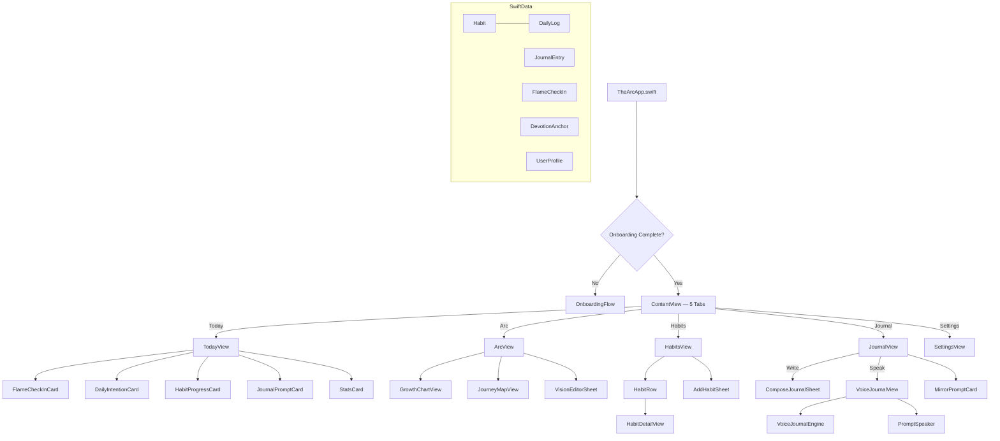
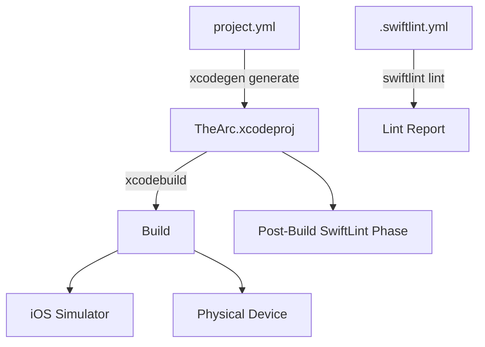

# The Arc — Living Project Whiteboard

Last verified: 2026-02-22T16:00:00Z
Status: Active source of truth for engineering and operations

## Purpose

This is the single, continuously updated engineering whiteboard for the full project.

Use this file to:

- Understand architecture and view flow quickly
- Track operational runbooks and build behavior
- Coordinate scheduled role work through one canonical task board
- Capture decisions, risks, and next actions

## How To Update This Doc

Update this file in the same commit whenever you change:

- Architecture, view flow, or data flow
- Build behavior or XcodeGen config
- Tooling, scripts, or quality checks
- Known risks/workarounds

Required updates per run:

1. Append one async event row to the appropriate shard slot.
2. Include task status, validation, next step, and one change note in that row.
3. Do not edit existing async event rows.

## Agent Coordination Contract

Global policy:

- `AGENTS.md` defines mandatory run behavior for any agent.
- Every scheduled run must read this file first, claim a task, execute, validate, and record.

Hard rules:

- This file is the only persistent run memory.
- Do not create external journals.
- Keep tasks scoped and reversible.

## High-Level System Flow



## Repo Map

```text
/
  .gitignore
  .gitattributes
  .swiftlint.yml
  AGENTS.md
  PROJECT_WHITEBOARD.md
  project.yml                    # XcodeGen spec
  Sources/
    App/
      TheArcApp.swift            # @main, modelContainer for 6 models
      ContentView.swift          # 5-tab TabView + onboarding gate
    Models/
      Habit.swift                # Habit model (frequency, streaks, completion)
      DailyLog.swift             # Per-day habit completion log
      JournalEntry.swift         # Journal entry (mood, promptType, body)
      Mood.swift                 # Mood enum (great→bad, emoji, color)
      ArcPhase.swift             # 9-phase hero's journey enum
      FlameCheckIn.swift         # Daily 0-10 alignment score
      DevotionAnchor.swift       # Core identity statement
      UserProfile.swift          # Phase, tone, vision, onboarding state
    Data/
      ReflectionPrompts.swift    # 30 daily + 12 mirror + 10 dip-recovery prompts
    Components/
      GlassCard.swift            # Reusable glass card container
      AdaptiveGlassBackground.swift  # Glass ViewModifier with fallbacks
      CircularProgress.swift     # Animated progress ring
      StreakBadge.swift           # Streak count badge
      MoodPicker.swift           # Mood selection row
      EmptyStateView.swift       # Empty state placeholder
      FlameSlider.swift          # 0-10 flame slider with animated icon
      ArcPhaseIndicator.swift    # 9-phase capsule chain indicator
      WaveformView.swift         # Live 40-bar audio waveform visualizer
      RecordButton.swift         # Pulsing mic button with breathing ring
    Views/
      Today/
        TodayView.swift          # Daily dashboard: flame + intention + habits + journal
        FlameCheckInCard.swift   # Daily 0-10 alignment check-in
        DailyIntentionCard.swift # Daily intention with reflection prompt
        HabitProgressCard.swift  # Circular habit progress ring
        JournalPromptCard.swift  # Today's journal entry preview/prompt
        StatsCard.swift          # Weekly stats summary
      Arc/
        ArcView.swift            # Growth Chart + Journey Map + Devotion Anchor
        GrowthChartView.swift    # Swift Charts 30/60/90-day flame tracking
        JourneyMapView.swift     # 9-phase arc + 5yr/10yr vision
        VisionEditorSheet.swift  # 5-year + 10-year calling editor
      Habits/
        HabitsView.swift         # Habit list with toggles
        HabitRow.swift           # Single habit row
        HabitDetailView.swift    # Habit stats + 28-day heatmap
        AddHabitSheet.swift      # Create/edit habit sheet
      Journal/
        JournalView.swift        # Journal list + mirror prompt + voice/write buttons
        JournalEntryRow.swift    # Entry preview with prompt type badge
        JournalEntryView.swift   # Full journal entry detail view
        ComposeJournalSheet.swift # Create/edit written entry
        MirrorPromptCard.swift   # Weekly deep-dive prompt card
        VoiceJournalView.swift   # Immersive voice recording + live transcript
      Onboarding/
        OnboardingFlow.swift     # 3-page: Welcome → Devotion → Personality Tone
      SettingsView.swift         # Theme, devotion anchor, phase, tone, vision, data
    Voice/
      VoiceJournalEngine.swift   # On-device SFSpeechRecognizer + audio metering
      PromptSpeaker.swift        # AVSpeechSynthesizer paced to PersonalityTone
  Resources/
    Assets.xcassets/
      Contents.json
      AccentColor.colorset/
      AppIcon.appiconset/
```

## Build Flow



### Commands

```bash
# Generate Xcode project
xcodegen generate

# Build for simulator
xcodebuild -project TheArc.xcodeproj -scheme TheArc \
  -destination 'platform=iOS Simulator,name=iPhone 17' build

# Lint
swiftlint lint --strict

# Fix auto-fixable lint issues
swiftlint lint --fix
```

## Technology Stack

| Layer | Technology | Notes |
|---|---|---|
| Language | Swift 6.0 | Strict concurrency enabled |
| UI Framework | SwiftUI | iOS 26 Liquid Glass patterns |
| Data | SwiftData | 6 models: Habit, DailyLog, JournalEntry, FlameCheckIn, DevotionAnchor, UserProfile |
| Charts | Swift Charts | GrowthChartView (LineMark + AreaMark) |
| Speech | Speech Framework | On-device SFSpeechRecognizer (privacy-first) |
| Audio | AVFoundation | AVAudioEngine (waveform), AVSpeechSynthesizer (TTS) |
| Deployment Target | iOS 18.0 | Minimum supported version |
| Build Generator | XcodeGen 2.44 | `project.yml` → `.xcodeproj` |
| Linting | SwiftLint 0.63 | Strict mode, performance rules |
| Design Language | Liquid Glass | With solid fallbacks for accessibility |

## iOS 26 Design Principles (Quick Reference)

### Material Layer Hierarchy

| Layer | Opacity | Purpose |
|---|---|---|
| Solid (Layer 4) | 100% | Critical text, icons, primary CTAs |
| Dynamic (Layer 3) | ~70% | Supporting text, secondary buttons |
| Glass (Layer 2) | ~40% | Decorative UI, dividers, subtle icons |
| Atmospheric (Layer 1) | ~20% | Background tints, overlays, depth |

### Key Rules

1. Let system handle tab bar / nav bar / toolbar glass — never override backgrounds
2. Use `.continuous` corner style everywhere
3. Max 2 glass layers stacked
4. Always check `reduceTransparency` + `isLowPowerModeEnabled` for fallbacks
5. Use `.foregroundStyle()` instead of `.foregroundColor()`
6. Use spring animations for interactions
7. Provide accessibility labels for icon-only buttons

## Known Gotchas

1. `*.xcodeproj` is git-ignored — regenerate with `xcodegen generate` after clone.
2. SwiftLint runs as a post-build script phase; install via `brew install swiftlint`.
3. `DEVELOPMENT_TEAM` in `project.yml` is empty — set your team ID for device builds.
4. iOS 26 glass effects are GPU-intensive — test on oldest supported device (iPhone 12).
5. Glass effects disable with Reduce Transparency — always provide solid fallbacks.
6. Voice features require microphone + speech recognition permissions (on-device only).
7. `@preconcurrency import` used for Speech/AVFoundation for Swift 6 strict concurrency.

## Change Safe-Zones

**Low risk:**
- Content/copy changes in Views
- Prompt bank additions in ReflectionPrompts
- Asset catalog updates

**Medium risk:**
- Navigation/routing changes in ContentView
- New view additions
- SwiftLint rule changes

**High risk:**
- project.yml structural changes (targets, settings)
- Swift concurrency model changes
- SwiftData model schema changes (migration required)
- Large architectural refactors without test coverage

## Decision Log

| Date | Decision | Reason | Owner | Revisit |
|---|---|---|---|---|
| 2026-02-22 | Use XcodeGen instead of manual .xcodeproj | Reproducible builds, merge-friendly, single source of truth | Engineering | Quarterly |
| 2026-02-22 | Target iOS 18.0 minimum with iOS 26 glass fallbacks | Wide device support while adopting new design language | Engineering | At iOS 27 beta |
| 2026-02-22 | Swift 6 strict concurrency from day one | Prevent race conditions early, align with modern toolchain | Engineering | Never (forward only) |
| 2026-02-22 | No GitHub Actions workflows | Avoid Actions pricing; validate locally | Engineering | When team scales |
| 2026-02-22 | SwiftLint with force_cast/try/unwrap as errors | Speed and crash-avoidance focus | Engineering | Monthly |
| 2026-02-22 | On-device only speech recognition | Privacy-first: voice never leaves the phone | Engineering | Never |
| 2026-02-22 | Rename `mastery` → `command` in ArcPhase | SwiftLint inclusive_language rule flags "master" | Engineering | Never |
| 2026-02-22 | Single VoiceJournalView for all voice modes | Simpler than 3 separate voice views, prompt passed as optional | Engineering | Phase 2 |

## Open Questions

1. ~~What is the app's primary domain/purpose?~~ → **Personal growth / FounderSelf**
2. ~~Should we add SwiftData persistence?~~ → **Done (6 models)**
3. Should we add SPM dependencies (e.g., networking)?
4. Icon design — use Icon Composer for layered iOS 26 icon?
5. Phase 2 scoping — when to start pattern detection / drift AI?

## Change Log

### 2026-02-22

- Initial project scaffold: XcodeGen, SwiftUI app, iOS 26 Liquid Glass components, SwiftLint, AGENTS.md
- Core features: 4-tab layout, habits tracking, journal, daily dashboard, glass components
- FounderSelf Phase 1: flame check-in, arc phases, devotion anchor, growth chart, journey map, onboarding, mirror prompts, reflection prompt bank
- Voice journal layer: VoiceJournalEngine (on-device), PromptSpeaker (TTS), WaveformView, RecordButton, VoiceJournalView (immersive)
- Privacy keys: microphone + speech recognition descriptions
- 45 Swift files, 0 SwiftLint violations, BUILD SUCCEEDED

## Role Task Board (Auto-Generated Snapshot)

Auto-generated from `Async Run Event Log`. Do not edit rows manually.

<!-- GENERATED_TASK_BOARD_START -->
| Task ID | Task | Suggested Role | Priority | Status | Last Updated | Notes |
|---|---|---|---|---|---|---|
| INIT-001 | Project scaffold and GitHub setup | sprinter | high | done | 2026-02-22 | Initial scaffold complete |
| CORE-001 | Core features (habits, journal, dashboard) | sprinter | high | done | 2026-02-22 | 4-tab layout, SwiftData models |
| VISION-001 | FounderSelf Phase 1 integration | sprinter | high | done | 2026-02-22 | 14 new files, 6 modified |
| VOICE-001 | Voice journal layer | sprinter | high | done | 2026-02-22 | On-device speech, immersive UX |
| PHASE2-001 | Phase 2: Insights, search, notifications | sprinter | high | done | 2026-02-22 | 6 new files, +943 lines |
<!-- GENERATED_TASK_BOARD_END -->

## Role Run Ledger (Auto-Generated Snapshot)

Auto-generated from `Async Run Event Log` (latest first). Do not edit rows manually.

<!-- GENERATED_RUN_LEDGER_START -->
| Timestamp (UTC) | Role | Task ID | Summary | Validation | Next Step |
|---|---|---|---|---|---|
| 2026-02-22T21:00:00Z | sprinter | PHASE2-001 | Insights dashboard, journal search, notifications | swiftlint 0/51; xcodebuild BUILD SUCCEEDED | Phase 3 features |
| 2026-02-22T19:50:00Z | sprinter | VOICE-001 | Voice journal layer: VoiceJournalEngine, PromptSpeaker, WaveformView, RecordButton, VoiceJournalView | swiftlint 0/45; xcodebuild BUILD SUCCEEDED | Phase 2 features |
| 2026-02-22T19:10:00Z | sprinter | VISION-001 | FounderSelf Phase 1: flame check-in, arc phases, growth chart, journey map, onboarding, mirror prompts | swiftlint 0/40; xcodebuild BUILD SUCCEEDED | Voice layer |
| 2026-02-22T18:30:00Z | sprinter | CORE-001 | Core features: habits, journal, dashboard, glass components, SwiftData | swiftlint 0/25; xcodebuild BUILD SUCCEEDED | FounderSelf integration |
| 2026-02-22T18:00:00Z | sprinter | INIT-001 | Initial scaffold with XcodeGen, SwiftUI, iOS 26 Liquid Glass, SwiftLint | xcodegen; swiftlint; xcodebuild | Core features |
<!-- GENERATED_RUN_LEDGER_END -->

## Async Run Event Log (Sharded, Merge-Safe, Append-Only)

This is the concurrency-safe whiteboard write target for multi-agent/PR workflows.

- Do not edit existing rows.
- Add one row per run.
- `Last verified` is derived from the latest timestamp in this section.

<!-- ASYNC_RUN_EVENTS_START -->
### Slot 00
| Event ID | Timestamp (UTC) | Role | Task ID | Task Status | Summary | Validation | Next Step | Change Note |
|---|---|---|---|---|---|---|---|---|

| 2026-02-22T18:00:00Z-sprinter-INIT-001 | 2026-02-22T18:00:00Z | sprinter | INIT-001 | done | Initial project scaffold: XcodeGen project.yml, SwiftUI app with iOS 26 Liquid Glass components (GlassCard, AdaptiveGlassBackground), SwiftLint config, AGENTS.md, PROJECT_WHITEBOARD.md, GitHub repo (no workflows) | xcodegen generate; swiftlint lint --strict; xcodebuild build (pending) | Define app domain, add first real feature views, set DEVELOPMENT_TEAM for device builds | Full project scaffold created |

### Slot 01
| Event ID | Timestamp (UTC) | Role | Task ID | Task Status | Summary | Validation | Next Step | Change Note |
|---|---|---|---|---|---|---|---|---|

| 2026-02-22T18:30:00Z-sprinter-CORE-001 | 2026-02-22T18:30:00Z | sprinter | CORE-001 | done | Core features: Habit/DailyLog/JournalEntry/Mood models, 4-tab layout, TodayView dashboard, HabitsView with streaks, JournalView with compose, SettingsView, glass components | xcodegen; swiftlint 0/25; xcodebuild BUILD SUCCEEDED | Integrate FounderSelf vision | +1621 lines, 25 files |

### Slot 02
| Event ID | Timestamp (UTC) | Role | Task ID | Task Status | Summary | Validation | Next Step | Change Note |
|---|---|---|---|---|---|---|---|---|

| 2026-02-22T19:10:00Z-sprinter-VISION-001 | 2026-02-22T19:10:00Z | sprinter | VISION-001 | done | FounderSelf Phase 1: FlameCheckIn, ArcPhase, DevotionAnchor, UserProfile, PersonalityTone, ReflectionPrompts, FlameSlider, ArcPhaseIndicator, 5-tab layout, onboarding flow, arc tab with growth chart + journey map, mirror prompts | xcodegen; swiftlint 0/40; xcodebuild BUILD SUCCEEDED | Voice journal layer | +1767 lines, 14 new files, 6 modified |

### Slot 03
| Event ID | Timestamp (UTC) | Role | Task ID | Task Status | Summary | Validation | Next Step | Change Note |
|---|---|---|---|---|---|---|---|---|

| 2026-02-22T19:50:00Z-sprinter-VOICE-001 | 2026-02-22T19:50:00Z | sprinter | VOICE-001 | done | Voice journal layer: VoiceJournalEngine (on-device SFSpeechRecognizer), PromptSpeaker (TTS paced to PersonalityTone), WaveformView (40-bar live visualizer), RecordButton (pulsing mic), VoiceJournalView (immersive full-screen), JournalView mic button, prompt type badges | xcodegen; swiftlint 0/45; xcodebuild BUILD SUCCEEDED | Phase 2 features | +640 lines, 5 new files, 3 modified |

### Slot 04
| Event ID | Timestamp (UTC) | Role | Task ID | Task Status | Summary | Validation | Next Step | Change Note |
|---|---|---|---|---|---|---|---|---|

| 2026-02-22T21:00:00Z-sprinter-PHASE2-001 | 2026-02-22T21:00:00Z | sprinter | PHASE2-001 | done | Phase 2: InsightsEngine (analytics), InsightsView (dashboard with period picker, flame summary, mood donut, habit scorecard, journal stats), FlameStreakCard, MoodRingChart, HabitScorecardView, NotificationManager (morning/evening reminders), journal .searchable(), ArcView Monthly Checkpoint link, SettingsView notification toggles | xcodegen; swiftlint 0/51; xcodebuild BUILD SUCCEEDED | Phase 3 features | +943 lines, 6 new files, 3 modified |

### Slot 05
| Event ID | Timestamp (UTC) | Role | Task ID | Task Status | Summary | Validation | Next Step | Change Note |
|---|---|---|---|---|---|---|---|---|

### Slot 06
| Event ID | Timestamp (UTC) | Role | Task ID | Task Status | Summary | Validation | Next Step | Change Note |
|---|---|---|---|---|---|---|---|---|

### Slot 07
| Event ID | Timestamp (UTC) | Role | Task ID | Task Status | Summary | Validation | Next Step | Change Note |
|---|---|---|---|---|---|---|---|---|

### Slot 08
| Event ID | Timestamp (UTC) | Role | Task ID | Task Status | Summary | Validation | Next Step | Change Note |
|---|---|---|---|---|---|---|---|---|

### Slot 09
| Event ID | Timestamp (UTC) | Role | Task ID | Task Status | Summary | Validation | Next Step | Change Note |
|---|---|---|---|---|---|---|---|---|

### Slot 0A
| Event ID | Timestamp (UTC) | Role | Task ID | Task Status | Summary | Validation | Next Step | Change Note |
|---|---|---|---|---|---|---|---|---|

### Slot 0B
| Event ID | Timestamp (UTC) | Role | Task ID | Task Status | Summary | Validation | Next Step | Change Note |
|---|---|---|---|---|---|---|---|---|

### Slot 0C
| Event ID | Timestamp (UTC) | Role | Task ID | Task Status | Summary | Validation | Next Step | Change Note |
|---|---|---|---|---|---|---|---|---|

### Slot 0D
| Event ID | Timestamp (UTC) | Role | Task ID | Task Status | Summary | Validation | Next Step | Change Note |
|---|---|---|---|---|---|---|---|---|

### Slot 0E
| Event ID | Timestamp (UTC) | Role | Task ID | Task Status | Summary | Validation | Next Step | Change Note |
|---|---|---|---|---|---|---|---|---|

### Slot 0F
| Event ID | Timestamp (UTC) | Role | Task ID | Task Status | Summary | Validation | Next Step | Change Note |
|---|---|---|---|---|---|---|---|---|

<!-- ASYNC_RUN_EVENTS_END -->
